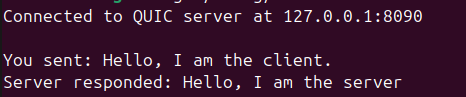
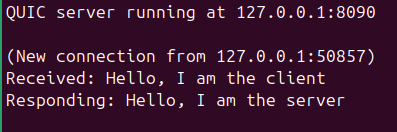

# QUIC Chat


A very simple client-server with a connection made using QUIC, using the quinn library.

**This project was developed in just a few hours as part of a training exercise over the weekend.**

## Screenshots

### Server


### Client


## Usage

1. Clone the repository:
    ```
      git clone https://github.com/Matheus-git/quic-chat.git
    ```
2. Navigate to the project directory:
    ```
      cd quic-chat
    ```
3. Configure client.rs and server.rs with the desired IPs and ports.

4. Generate the certificate ( and private key ) at certs/ .
    ```
      cargo run --bin quic-chat
    ```
5. Start server:
    ```
      cargo run --bin server
    ```

6. Start client (in another terminal):
    ```
      cargo run --bin client
    ```

### Running the Server and Client on Different Hosts

If you want to run the server and client on different hosts, you need to ensure that both use the same set of certificates. Follow the steps below:

1. **Certificates**
   - Both the server and client must use the same certificate pair for the QUIC connection.
   - The **server** will need both `cert.pem` (certificate) and `cert.key` (private key) to work properly.
   - The **client** only needs the `cert.pem` (certificate), as it only validates the server's certificate during the connection.

2. **Steps:**
   - Place the `cert.pem` and `cert.key` files in the server’s directory.
   - On the client, copy only the `cert.pem` file to the appropriate directory.

Make sure the certificate paths are correctly configured on both sides to ensure a secure connection.

## Contributing

Contributions are welcome! Please open an issue or submit a pull request for any improvements or bug fixes.

## 📝 License

This project is open-source under the MIT License.
